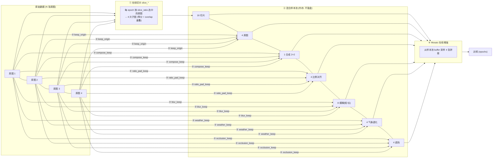

# 项目说明：Ultralytics 在线数据增强与修补续训扩展

> 在原生 Ultralytics（YOLO26）基础上，**不改动原有训练功能**，通过「索引空间扩展」把「在线切片 / 在线合成 / 在线比例调整 / 在线运动模糊 / 在线气象退化 / 在线遮挡模拟」全部搬进内存数据管线，与 Mosaic 无缝衔接；并集成「训练提前终止后的 checkpoint 修补续训」与「验证侧切片评估」。所有中间产物默认不落盘，除非显式指定保存目录。

---

## 一、整体流程

4 张原图 → 在线切片（16 切片，由 `slice_ratio` 按 epoch 决定哪些原图走切片）+ 保留原图（4）+ 在线合成（1 张 2×2 大图）+ 在线比例调整（4）+ 在线运动模糊（8，短/长各 2）+ 在线气象退化（4，雨/雾/噪声）+ 在线遮挡模拟（4，rect/stripe）= **41 张混合样本池**，一起进入 Mosaic 采样，mosaic 从中取 4 张拼成训练尺寸。



样本池采用**区段式布局**：基础区段（切片）+ 6 个独立区段（原图/比例/模糊/合成/气象退化/遮挡），每个区段只受自己的开关控制，互不影响：

```text
[0, 4N)                      切片     slice_prob / slice_all_tiles（slice_ratio 决定哪些原图进本区段）
[4N, 5N)                     原图     slice_keep_origin（独立开关，不再耦合切片）
[5N, 6N)                     比例     ratio_pad_keep
[6N, 8N)                     模糊     blur_keep（每图短/长 2 张）
[8N, 8N+ceil(N/4))           合成     compose_keep
[8N+ceil(N/4), +N)           气象退化 weather_keep
[8N+ceil(N/4)+N, +N)         遮挡     occlusion_keep
全开总数 = 10 × N + ceil(N/4)          （N=4 时 = 41）
```

训练开始时，日志会打印实际参与训练的样本数（如 `Online augment: 231 training samples from 28 images (4 slices + 1 origin + 1 ratio + 2 blur + N/4 compose per image)`），可用于快速确认各增强是否参与训练。

---

## 二、核心设计思路（从 0 构建）

### 2.1 为什么"在线"而不是"离线"

项目最早是**离线工具**（`pytools/` 下的切片/合成/比例/模糊脚本），离线方案的痛点：

- 每个增强都要落盘大量图片 + 标签文件，磁盘爆炸、IO 慢；
- 参数改一下要重跑整个预处理流程；
- 增强后的图片被"固化"，无法与 Mosaic 这类训练期增强组合。

**在线化思路**：把每个增强做成一个"内存函数"，在数据管线取样本时即时生成，参数在 `train.py` 里实时可调，生成结果直接进 Mosaic 的采样 buffer，全程不碰磁盘。中间产物要检查时，通过各模块的 `*_save_dir` 显式落盘。

### 2.2 核心难点：如何让"虚拟样本"进入 Mosaic

Ultralytics 的 Mosaic 是从 `dataset.buffer` 里随机采样多张图拼接的。切片/合成/比例/模糊/气象退化/遮挡产生的图都是"原图上派生的虚拟样本"，要让它们被 Mosaic 采到，关键是**索引空间扩展**：

- 数据集 `__getitem__` 的索引空间从 `N`（原图数）扩展为 `10N + ceil(N/4)`（全开）；
- `get_image_and_label` 里按区段边界路由：先判遮挡/气象/合成/模糊/比例/原图区段，落在基础区段 `[0, 4N)` 时用 `index // n_per` 还原到哪张原图、`index % n_per` 决定取哪个 tile（0-3）；
- 每个子样本都按原图路径即时加载原分辨率图 → 应用对应变换 → `buffer.append(index)` 用**扩展后的索引**维护，Mosaic 就能采到所有虚拟样本。

### 2.3 样本池长度恒定（硬约束）+ buffer 记账

`__len__` 必须恒定（4N 或全开 `10N+ceil(N/4)`）：DataLoader 的 len 在构建时确定一次，预计算 + len 不恒定会导致 Mosaic buffer 记账错乱、epoch 内样本数漂移（早期踩过 `IndexError: list index out of range`）。因此所有在线模块都遵循：

- **位置保留、内容替换**：每个样本位永远产出"像素与 bbox 匹配"的样本；
- **被拒背景片退回原图** 正是这一原则的体现——不丢样本位，换成信息更丰富的原图；
- 四个比例参数（`compose_ratio` / `ratio_pad_ratio` / `blur_ratio` / `weather_ratio` / `occlusion_ratio`）的"未选中位退回整图"同样遵循此原则。

**buffer 记账有两套路径，必须互斥**（修过的坑）：

| 路径                                     | 索引             | 激活条件                       |
| ---------------------------------------- | ---------------- | ------------------------------ |
| `load_image` 自管（纯原版）              | 原图索引 `i`     | 无切片 **且** 无任何扩展段开启 |
| `get_image_and_label` 统一记账（本项目） | 扩展索引 `index` | 切片开启 **或** 任一扩展段开启 |

- 若 `load_image` 在扩展池开启时仍自管 buffer，会 pop 到扩展索引 → `ims[j]` 越界（`IndexError: list assignment index out of range`）；
- 若 `get_image_and_label` 在"切片关 + 扩展段开"时漏记账，base 段样本不进 buffer → Mosaic `random.choices` 空列表崩（`IndexError: list index out of range`）；
- 两处条件互补，纯原版时 `load_image` 恢复原生行为，全关完全等价原生 Ultralytics。

### 2.4 标签始终与像素对齐

每个在线变换都同步换算 bbox 坐标，保证"图像像素 ↔ 标签框"一一对应：

| 变换                | 坐标处理                                                          |
| ------------------- | ----------------------------------------------------------------- |
| 切片                | 裁剪窗口偏移量叠加到框坐标，越界部分裁剪                          |
| 合成 2×2            | 各象限平移量叠加，全局坐标重算                                    |
| 比例调整            | 加边框的偏移量叠加                                                |
| 运动模糊 / 气象退化 | 目标不动，**标签原样不变**                                        |
| 遮挡模拟            | 绘制不移动标签；目标被遮面积 ≥ `occlusion_max_cover` 才从标签剔除 |

切片在**原分辨率**图像上进行（而非训练缩图），这样小目标在子图缩放到训练尺寸（1280）时被真正放大——这是航拍小目标提升的关键。

### 2.5 可验证、可关闭、不改变原生功能

- **可关闭**：每个模块都有**真正独立的开关**（`slice_prob` / `slice_keep_origin` / `compose_keep` / `ratio_pad_keep` / `blur_keep` / `weather_keep` / `occlusion_keep` 互不影响），全关时完全等价原生 Ultralytics；
- **可验证**：中间产物默认不保存；需要检查时指定 `*_save_dir`，保存**带标注框**的 JPG，按 `*_save_max` 限张数、按 `(图像, 切片/类型)` 去重（跨 epoch 每张只存一次）；
- **不越界**：所有改动集中在 `data/augment.py`、`data/base.py`、`data/online_degrade.py`、`data/online_io.py`、`engine/trainer.py`、`models/yolo/detect/val.py`、`cfg/`，不触碰模型结构、损失函数、评估逻辑。

### 2.6 独立开关 + epoch 级精确比例

比例参数与 `slice_ratio` 完全同构，全部由 `set_epoch(epoch, epochs)` 重建掩码；掩码经共享内存 epoch 通道（`_mp_epoch`/`_sync_epoch_masks`）传播到各 DataLoader worker，各进程按确定性 RNG（`crc32(文件列表):epoch:epochs`）重建完全一致的掩码，无 per-worker 漂移（Windows spawn 下不依赖 "fork 继承"；`persistent_workers=True/False` 均安全）：

| 参数              | 粒度   | 语义                                                             |
| ----------------- | ------ | ---------------------------------------------------------------- |
| `slice_ratio`     | 原图级 | 每 epoch 精确选 `round(x×N)` 张原图走切片                        |
| `compose_ratio`   | 组级   | 每 epoch 选 `round(x×⌈N/4⌉)` 组合成，未选中组退回组内第 1 张原图 |
| `ratio_pad_ratio` | 原图级 | 每 epoch 选 `round(x×N)` 张做比例调整，未选中直接整图            |
| `blur_ratio`      | 原图级 | 每 epoch 选 `round(x×N)` 张做模糊，短+长同命运，未选中整图×2     |
| `weather_ratio`   | 原图级 | 每 epoch 选 `round(x×N)` 张做气象退化，未选中整图直通            |
| `occlusion_ratio` | 原图级 | 每 epoch 选 `round(x×N)` 张做遮挡，未选中整图直通                |

- 未选中位全部**位置保留、内容替换**，`len` 恒定；
- `ratio >= 1.0` 或开关关闭 → 掩码 None（全量/关闭，零开销，完全向后兼容）；
- `close_aug_epoch=N`：`epoch >= epochs - N` 时六个掩码全部置为**全 False**（各区段退回原图直通，len 恒定），模型在最后 N 个 epoch 只在真实样本分布上收敛。

### 2.7 读参统一兜底：`_hyp_get` 与"三处齐动"

`v8_transforms` 读取在线配置键统一走模块级 `_hyp_get(hyp, key)`，解析顺序 = `hyp` 属性 → 显式默认值 → `default.yaml`（默认值的**唯一真源**）。键在 `hyp` 和 `default.yaml` 里都没有时抛 `ValueError` 并指名该键。这把"**新增配置键要同时改 `default.yaml` + `cfg/__init__.py` + 实际传递点**"这条约定由**代码强制**，不再只靠注释提醒——否则从旧 `args.yaml` / 旧 checkpoint 的 `train_args` 恢复配置时，缺键会在数据增强构造阶段抛 `AttributeError`，整个训练起不来。

---

## 三、模块详解

### 3.1 在线切片（SAHI 在线化）

- **实现**：`ultralytics/data/augment.py` 的 `OnlineSlice` 类（`slice_at` / `__call__`），离线工具是 `pytools/sahi_equal_division_slice_dataset_auto_improved.py`。
- **切法**：原图等分 4 片（2×2 网格），`slice_overlap_ratio` 控制相邻重叠；例：4000×3000 + 重叠 0.2 → 切片 2400×1800。
- **发射策略**：`slice_all_tiles=True` 时每张原图的 4 片子图**全部参与训练**（基础区段固定 4N）；`False` 时每图随机取 1 片。

#### 3.1.1 切片/整图混排：slice_ratio（epoch 级原图级精确比例）

每个 epoch 开始时由 `trainer.py` 调用 `dataset.set_epoch(epoch)` 重建掩码，**精确选 `round(x × N)` 张原图**走在线切片，其余原图整图进池。

- **原图级决策**：同一原图的 4 片同生共死（要么全切片，要么全整图）；
- **每 epoch 重新随机**：掩码经共享内存 epoch 通道传播到各 worker，各进程按确定性 RNG 重建完全一致的掩码 → 无 per-worker 漂移、比例精确；
- `slice_ratio=1.0`（默认）→ 掩码 None = 纯切片（旧行为）；`0` → 全整图（等效关闭切片）；
- `len` 恒为 4N，不受影响。

#### 3.1.2 目标保留判定（双重面积过滤）

| 参数                            | 作用                                                           |
| ------------------------------- | -------------------------------------------------------------- |
| `slice_min_tile_area_ratio`     | 切片块面积下界，过小的切片直接丢弃                             |
| `slice_min_box_retain_ratio`    | 目标在片内可见面积 / 原框面积 < 该值则丢弃该目标               |
| `slice_center_constraint`       | 目标唯一归属：只分配给中心所在切片，防被切两半重复             |
| `slice_min_center_retain_ratio` | 中心不在本片时，片内可见占比 ≥ 该值仍保留；1.0=严格只留中心片  |
| `slice_full_box_only`           | 目标必须完整落在片内才保留，被边界切开即过滤（优先于中心约束） |

#### 3.1.3 目标感知切缝（`slice_center_bias`）

**问题**：固定 2×2 网格的切缝位置与目标位置无关，目标恰在切缝上会被劈成两半（中心约束/整框保留只能事后归属或过滤，改变不了"被切"的事实）。

**机制**：切缝按本图目标中心分布微移——目标中心投影到 x/y 轴，竖缝/横缝选在 `[margin, 1-margin]` 区间内目标最稀疏的候选位置；tile 数量/全图覆盖/重叠总量（`2*sw - w`）不变（正 bias 加宽左/上 tile 并等量收窄右/下 tile）。

| 参数                | 默认  | 作用                                                                                                                         |
| ------------------- | ----- | ---------------------------------------------------------------------------------------------------------------------------- |
| `slice_center_bias` | False | 目标感知切缝总开关；False=固定网格，完全向后兼容                                                                             |
| `slice_bias_margin` | 0.25  | 切缝偏移窗口：只在 `[margin, 1-margin]` 内微移，保证 tile 不过小                                                             |
| `slice_bias_jitter` | 0.05  | 切缝抖动幅度（相对原图边长）：**每张原图每 epoch 只抖一次**——同一图同一 epoch 的 4 片共用同一张网格，跨 epoch 才变化；0=关闭 |

> **切缝的确定性**：抖动由 `(epoch, 原图索引)` 派生的确定性 RNG 产生，与全局 `random` 流解耦——同一图同一 epoch 的网格**可复现**，且 `slice_all_tiles=True` 下 4 片**必然共享一张网格**（否则 4 片互相矛盾，且并集不再保证覆盖全图）。
> ⚠️ 覆盖承诺有边界：把 `slice_bias_jitter` 调到 **≳0.21**（`slice_overlap_ratio=0.2` 时）会重新出现覆盖空洞（实测 0.22 时 20/200 图有洞、0.25 时 53/200），因为抖动幅度已接近重叠余量；默认 0.05 安全。重叠更大（如 0.4）时余量更宽。

**与现有参数关系**：与 `slice_center_constraint` 互补建议同开（bias 事前躲缝减少劈碎，constraint 事后兜底残余）；`slice_overlap_ratio` 语义不变；`close_aug_epoch` 回退固定网格；验证侧 `SliceValDataset` 用固定网格不受影响。

**验证**（20 张小验证集真实标签 + 合成极端分布）：被切缝劈中的目标 OFF=16 → ON=2（**减少 88%**）；端到端 1 epoch 跑通，len 恒定。

#### 3.1.4 背景切片控制

- `slice_background_ratio` = 背景切片数 / 正切片数；-1 全部背景保留，0 不要背景；配额跨原图累计。
- **被拒背景片退回整张原图**（带全量 bbox），不再裁成空片占位。原因：空片与背景片在训练视角等价（同一块裁剪区域 + 空标签），负样本占比由切片几何锁死（目标稀疏场景可达 ~67%），`background_ratio` 调不动它；退回原图后负样本占比由 `background_ratio` 真实控制（实测 67% → 12.5%），且退回原图 = 隐式过采样正样本。

#### 3.1.5 保留原图（slice_keep_origin，独立开关）

额外把 1 张未切片原图放进样本池（提供全图上下文）。它是独立的 `[4N, 5N)` 区段，开关不受 `slice_prob=0` 影响；但切片关闭时自动抑制（原图本来就在池里，再保留即重复）。

> 注意：被拒背景片位会退回原图，`slice_keep_origin` 的整图功能被覆盖（每图可能出现约 3.7 份原图冗余）——**建议设 `slice_keep_origin=False`**，仅当"目标密集、4 片几乎全有目标"时保留它提供唯一整图上下文。

### 3.2 在线合成（compose）

- **实现**：`base.py` 的 `_build_compose_sample`，离线工具是 `pytools/compose_slice_dataset_auto_improved.py`。
- **作用**：每 4 张原图拼成 1 张 2×2 大图，让模型看到更大范围的多目标上下文（目标仍完整保留、坐标平移重算）。
- **开关**：`compose_keep=True`（独立开关）+ `compose_save=True`（保存用于检查，需指定 `compose_save_dir`）。
- **比例**：`compose_ratio`（组级，默认 1.0）——每 epoch 选 `round(x×⌈N/4⌉)` 组合成，未选中组退回组内第 1 张原图（len 恒定）。
- **拼后降采样（`compose_max_side`）**：0=自动=2×imgsz（默认开启）；>0=手动指定最长边上限（如 2560）；<0=关闭（全分辨率拼接）。实现为**逐张源图先限幅、再分配画布**（不再"拼到全分辨率再整体缩小"）：4 张 4000×3000 原图拼出 8000×6000（≈144MB/张）→ 画布天然 ≤ 上限（≈18MB，约 **20 倍内存下降、7.8 倍提速**）；bbox/segment/keypoint 均为**归一化坐标**，只缩放像素不影响标签。这是缓解在线增强 worker 内存峰值（第 2 epoch 卡死）的关键手段，合成图保留的是"多目标上下文"而非细节，降采样零语义损失。

### 3.3 在线比例调整（ratio_pad）

- **实现**：`base.py` 的 `_build_ratio_sample` + `_ratio_pad_params`，离线工具是 `pytools/change_image_resolution_slice_dataset_auto_improved.py`。
- **作用**：给图加边框（不缩放、不裁剪）统一宽高比，避免训练时被拉伸变形。`ratio_pad_color` 可选 black/gray/white（gray=114,114,114，与 YOLO letterbox 一致）。
- **目标比例**：`ratio_pad_target="auto"` 时，4:3 ↔ 16:9 双向对齐，其他比例缩放到离它最近的 4:3 或 16:9；也可指定具体比例。
- **比例**：`ratio_pad_ratio`（原图级，默认 1.0）——每 epoch 选 `round(x×N)` 张做比例调整，未选中直接整图（len 恒定）。

### 3.4 在线运动模糊（blur）

- **实现**：`base.py` 的 `_build_blur_sample` + `online_degrade.py` 的 `_apply_motion_blur`（运动模糊核 + 可选高斯失焦），离线工具是 `pytools/motion_blur_improved.py`。
- **作用**：模拟无人机运动失焦。每张原图生成 **2 张**模糊副本——短模糊（轻度、无失焦）与长模糊（重度、可选失焦），标签不变。
- **参数**：`blur_short_len_min/max`（短模糊像素长度）、`blur_long_len_min/max`（长模糊长度）、`blur_long_defocus_sigma`（失焦强度，0=不加）。
- **拖影方向（`blur_axis_aligned`，默认 True）**：把拖影限制为**像面轴对齐**（水平/垂直二选一），适用于相机安装固定、运动方向在像面上恒定映射到水平或垂直的场景（车载 / 航拍沿航迹）；这类域里轴对齐是更贴合的建模。该路径与任意角路径**逐位等价**（轴对齐时 PSF 恰好就是均匀箱式），但走 `cv2.blur` 的 O(1) 行程和实现，实测两档合计 28.1→15.4 ms/图（**1.82×**）。需要任意角时设 `False` 回退。
- **比例**：`blur_ratio`（原图级，默认 1.0）——每 epoch 选 `round(x×N)` 张做模糊，短+长同命运，未选中整图×2（len 恒定）。

### 3.5 Mosaic 在线增强、保存与后期关闭

- 原生 Mosaic 保留（`mosaic=1.0`），样本池 buffer 被上述虚拟样本填充后，Mosaic 从中采样 4 张拼接。
- **保存开关**：`mosaic_save_dir`（指定才保存，用于验证 mosaic 是否正常启用）、`mosaic_save_max`、`mosaic_save_annotated`。
- **训练后期统一关闭（`close_aug_epoch`，与 `close_mosaic` 同构的时间维调度）**：`close_aug_epoch=N` 时，`set_epoch(epoch, epochs)` 在 `epoch >= epochs - N` 阶段把切片/合成/比例/模糊/气象退化/遮挡六个掩码全部置为**全 False**——各区段"位置保留、内容替换"退回原图直通（len 恒定），模型在最后 N 个 epoch 只在真实样本分布上微调收敛，缓解小数据集后期过拟合到增强分布。`0`=不启用（默认，完全向后兼容）。
- **与 patience 的关系**：`close_aug_epoch` 是纯时间驱动，`patience` 是纯指标驱动。早停会"杀死"末期关闭（若 mAP 提前到顶，关闭点未到就早停）；末期关闭会"救活"早停（关闭增强后验证 mAP 常小幅上升 → 刷新 best_epoch → patience 清零）。配置二选一：想让 `close_aug_epoch` 生效 → `patience` 设大或 0；想靠早停控时 → 别指望末期关闭。

### 3.6 在线遮挡模拟（occlusion）

- **实现**：`base.py` 的 `_build_occlusion_sample` + `online_degrade.py` 的 `_apply_occlusion`。
- **作用**：模拟航拍场景真实遮挡——树冠/阴影（rect 随机矩形）、电线/枝干/云影（stripe 细长条带，近水平/垂直），让模型学会"目标被遮一部分也能认出"（遮挡鲁棒检测）。
- **标签策略**：绘制本身**不移动标签**；`occlusion_max_cover`（默认 0.95）——目标被遮挡面积占比 ≥ 阈值则从标签剔除（完全被盖住的目标=纯噪声，留着会教模型"看不见也报"）；=1.0 时标签永不变。
- **颜色**：`occlusion_color=auto`（默认）采样图像暗 25% 分位均值作为块色（大步长均匀采样取分位，融入场景而非突兀黑块）；也可固定 `black`/`gray`。
- **开关与比例**：`occlusion_keep`（独立开关）+ `occlusion_ratio`（原图级，默认 0.5）——每 epoch 选 `round(x×N)` 张做遮挡，未选中整图直通（len 恒定）；与 blur/weather 同构，`close_aug_epoch` 联动关闭。
- **区段**：`[8N+⌈N/4⌉+N, +N)` 在 weather 段之后；N=4 全开 = 16+4+4+8+1+4+4 = **41 张**混合样本池。
- **保存**：`occlusion_save_dir`（指定才保存，画框/按图+类型跨 epoch 去重/`slice_save_max_occlusion` 限数量）。

### 3.7 验证侧在线切片评估（val*slice*\*，SAHI 评估）

#### 3.7.1 为什么需要：训练/验证分布不一致

训练侧在线切片把小目标**放大**后喂给模型，模型学到的是"放大后的小目标"特征；但验证时整图直接推理，小目标在原图尺度上只有几个像素，直接被降采样糊掉 → 漏检 → mAP 偏低且失真：切片训练的收益被低估，`slice_ratio` / `slice_background_ratio` 等调参反馈不可信。

#### 3.7.2 语义：验证侧切片 ≠ 训练侧切片

| 维度         | 训练侧 `slice_*`                                       | 验证侧 `val_slice_*`              |
| ------------ | ------------------------------------------------------ | --------------------------------- |
| 目的         | 让模型看到"干净放大的目标"                             | 评估"切片推理"的检测能力          |
| 目标过滤     | 有（min_retain / center / full_box_only / background） | **无**：每片全部推理，框全保留    |
| 重叠区重复框 | 有意保留（同目标多片）                                 | NMS 融合消除                      |
| 复用         | `OnlineSlice`（含过滤）                                | 仅复用 `slice_geometry`（纯几何） |

验证侧是一个独立轻量数据集 `SliceValDataset`（`base.py`）：包装原生验证 `YOLODataset`，复用其 labels/transforms/collate_fn；`len = Σ 每图片数`（`val_slice_all_tiles=True`→4 片，False→随机 1 片；`val_slice_ratio<1`→mask 选中图切片、未选中整图 1 片）。每样本携带 `val_slice_meta`（原图索引/偏移/子图尺寸/片数），供推理后还原。

#### 3.7.3 推理后处理：还原 → NMS 融合 → 与整图 GT 结算

1. **坐标还原**：子图预测框（imgsz 画布）→ 逆 LetterBox → 子图像素 → `+offset` → 原图像素；
2. **NMS 融合**：同一原图的所有子图框按类做 NMS（`val_slice_nms_iou`）去重（`torchvision.ops.batched_nms`）；
3. **结算**：融合框与原图 GT（原图像素空间）走原生 `update_stats`；`seen` 按**原图数**计（非子图数）。

#### 3.7.4 双口径 mAP 与两套权重（val_slice_dual_metric）

`val_slice_dual_metric=True` 时每轮验证跑**两遍**：

| 口径         | 指标键               | fitness                            | best/last                         |
| ------------ | -------------------- | ---------------------------------- | --------------------------------- |
| 切片（主）   | `metrics/mAP*`       | **主 fitness**（驱动早停/best.pt） | `best.pt` / `last.pt`             |
| 整图（参考） | `whole_metrics/mAP*` | `fitness_whole`（仅驱动副权重）    | `best_whole.pt` / `last_whole.pt` |

- 主验证前若 `val_slice_enable` 强制 `dataloader=None` 重建为切片 loader（trainer 预建的 `test_loader` 是整图 loader，不重建则 val_slice 不生效）；dual 第二遍临时关掉切片跑整图验证；
- `model.val()` 默认 `rect=True` 与切片推理冲突（labels 无真实 shape → 空 tile），val_slice active 时自动强制 `rect=False` 重建；
- **主路径兼容**：`resume`/早停/续训全部仍走 `last.pt`（切片口径），`best_whole.pt` 仅作与旧实验公平对比的参考产物。

#### 3.7.5 开销

验证耗时：切片口径 ≈ ×切片数（每图多次前向），双口径 ≈ ×(1+切片数)；可降低 `val_slice_all_tiles=False`（每图 1 片）或 `val_slice_ratio<1`（部分图切片）提速；`val_slice_enable=False` → 完全回归原生整图验证。

### 3.8 修补续训 vs 无缝续训（resume_extend_epochs）

#### 3.8.1 checkpoint 里到底存了什么

一个 Ultralytics `last.pt` 不只是模型权重，它打包了训练的全部"运行状态"：

| 组件               | 作用                                              | strip 前 | strip 后                |
| ------------------ | ------------------------------------------------- | -------- | ----------------------- |
| **model 权重**     | 网络全部参数                                      | ✅       | ✅ 保留                 |
| **optimizer 状态** | SGD 动量 buffer / Adam 的 `exp_avg`、`exp_avg_sq` | ✅       | ❌ 丢弃                 |
| **EMA 权重**       | 指数移动平均的平滑模型副本（验证/选 best 用它）   | ✅       | ❌ 丢弃                 |
| **GradScaler**     | AMP 梯度缩放因子                                  | ✅       | ❌ 丢弃                 |
| **epoch**          | 当前轮索引                                        | 真实值   | 置为 `-1`（标记已完成） |
| **train_args**     | 训练配置                                          | ✅       | ✅ 保留                 |

`strip_optimizer`（优化器剥离）是 Ultralytics 在**训练自然结束**时做的最终化：删掉 optimizer/EMA/scaler 以缩小体积，方便部署与分享。

#### 3.8.2 训练结束路径决定 last.pt 状态

关键机制：`trainer.py` 的 `final_eval()`（训练循环 break 后无条件执行）会对 `last.pt` 调用 `strip_optimizer`。因此——

| 训练如何结束                        | last.pt 状态                       | 续训方式     |
| ----------------------------------- | ---------------------------------- | ------------ |
| 跑满 epochs                         | strip 过（无 optimizer、epoch=-1） | **修补续训** |
| patience 早停触发                   | strip 过（无 optimizer、epoch=-1） | **修补续训** |
| 进程被硬中断（Ctrl+C / OOM / 崩溃） | 保留完整 optimizer、epoch=真实停点 | **无缝续训** |

**结论**：只有进程级硬中断（`final_eval` 没机会运行）才能留下含 optimizer 的 `last.pt`——那才是真正意义的"断点续传"。正常结束（含早停）的 `last.pt` 注定是 strip 过的完成品，原版 resume 会拒绝（"training to X epochs is finished"）。这正是"修补续训"存在的理由。

#### 3.8.3 两种续训方式的差异

| 维度             | 无缝续训（含 optimizer） | 修补续训（无 optimizer）  |
| ---------------- | ------------------------ | ------------------------- |
| model 权重       | ✅ 保留                  | ✅ 保留                   |
| optimizer 动量   | ✅ 接续，曲线连续        | ❌ 重新初始化，需重新预热 |
| EMA 平滑副本     | ✅ 接续                  | ❌ 从当前权重重新累积     |
| GradScaler (AMP) | ✅ 接续                  | ❌ 重建                   |
| LR schedule      | 从停点继续               | 按新总轮数重建            |
| epoch 计数       | 从停点+1 继续            | 从停点+1 继续             |
| 本质             | "训练没停过"             | "用上次权重重新优化"      |

修补续训比从预训练权重从头训快很多（保留了训练成果），但不是无缝级别。

#### 3.8.4 如何判断一个 ckpt 能否无缝续训

```python
import torch

ck = torch.load("last.pt", map_location="cpu", weights_only=False)
print("可无缝续训:", ck.get("optimizer") is not None and ck.get("epoch", -1) >= 0)
```

或者用 `model.train(resume=True)`（布尔值）——框架会自动检查 optimizer，没有则降级为新训练。注意：resume 传**路径字符串**会绕过这层检查，直接走到断言。

#### 3.8.5 集成实现与参数设置

**集成**：`trainer.py` 的 `resume_training` 内嵌自动修补块——设置 `resume_extend_epochs=N` 时，自动检测已完成轮数（中断场景=ckpt.epoch+1；已完成场景=从 train_args 读原 epochs），校验 `N > 已完成轮数`（否则 ValueError），把 ckpt 的 `epoch` 改回 `finished-1`、`epochs`/`patience` 修补为新值、重建 LR schedule，从停点+1 续训到 N。逻辑复用离线工具 `pytools/fix_checkpoint_for_extension.py`。

**`resume_extend_epochs` 怎么设**（硬约束 + 建议）：

| 续训目的                | resume_extend_epochs     | patience 建议       |
| ----------------------- | ------------------------ | ------------------- |
| 纯验证续训是否工作      | 已完成 + 小增量（如 15） | 不变                |
| 跑满 epochs，模型还在涨 | 给足大目标（如 200/400） | 保持/适当调大       |
| 早停后想突破平台期      | 给足大目标（如 200/400） | **调大**（如 100+） |

- **硬约束**：`resume_extend_epochs` 必须 > 已完成轮数（`extend ≤ finished` 直接 ValueError）；
- **为什么建议设足**：修补续训时动量清零需预热，且 LR schedule 按新总轮数重建（如 cosine 重新展开），给足轮数才有机会突破平台；只续几轮动量没预热就停，**可能反而不如原模型**；
- **patience 联动**：早停靠 `patience` 触发，若续训后仍用原值且模型已收敛，会被立刻再次早停，大目标跑不到——所以"早停后续训"要同步调大 patience。

### 3.9 在线气象退化（weather，雨/雾/噪声）

- **实现**：`base.py` 的 `_build_weather_sample` + `online_degrade.py` 的 `_apply_weather`（纯内存生成，无离线工具）。
- **作用**：提升航拍模型在恶劣天气（雨 / 雾 / 噪声）下的鲁棒性。每张原图生成 **1 张**退化图，类型从 `weather_types`（逗号分隔，如 `"rain,haze,noise"`）**每张随机抽 1 种**，标签不变（退化不移动目标）。
- **三种退化（强度每次调用随机采样，避免过拟合单一强度）**：
  - **雨**：`weather_rain_density`（雨线数量 ≈ density×max(h,w)）+ `weather_rain_length`（线长上限，每根随机取 0.5~1.0 倍），固定 20° 斜向、半透明叠加（alpha 0.2~0.6，向量化批量绘制）；
  - **雾**：`weather_haze_beta`（[0,1)，越大雾越浓），大气散射模型 `I = J×(1-β) + A×β`，A=灰色大气光 200；
  - **噪声**：`weather_noise_std`（每通道独立高斯噪声，`cv2.randn` 单缓冲），模拟传感器/弱光噪点。
- **比例**：`weather_ratio`（原图级，默认 0.5）——每 epoch 选 `round(x×N)` 张做退化，未选中整图直通（len 恒定）。**权衡**：增强分布过宽会拖累干净场景精度，推荐 0.3~0.6。
- **保存**：`weather_save_dir`（指定才保存，画框/限数量/按图+类型跨 epoch 去重）；上限 `slice_save_max_weather`，回退 `slice_save_max`。
- **与 `close_aug_epoch` 联动**：close 分支同样把 weather 掩码置全 False，最后 N 个 epoch 不再引入退化分布。

### 3.10 退化分支工作分辨率上限（degrade_max_side）

blur / weather / occlusion / ratio 四条退化分支都是**像素级操作**（O(像素数)），在原始分辨率（如 4000×3000）上执行后再缩到训练尺寸，造成大量可避免的开销与内存峰值。

- **实现**：`online_degrade.py` 的 `_cap_long_side(im, cap, interp)` 是唯一的工作分辨率实现；`base.py` 的 `_degrade_frame(img_index) -> (img, scale)` 统一取退化分支的帧，并**按 `scale` 等比缩放自身参数**（PSF 长度与 σ、雨线长度）；
- **参数**：`degrade_max_side`——`0`=自动=`2×imgsz`（默认开启）、`>0`=手动指定、`<0`=关闭；`degrade_resample`——`"area"`=抗锯齿更好但慢（4000×3000 单次 ~21.5ms）、`"linear"`=快 3 倍但画质略软（~7.8ms），两者几何完全一致，默认 `linear`；
- **收益**：退化增强不再"先全分辨率执行、再降采样"，实测 11.5× 可避免开销；极端长宽比下比例调整不再先撑大再缩小（像素膨胀 ~4.5×）。

---

## 四、性能与内存优化（排障经验）

### 4.1 第 2 epoch 卡住的根因与手段

远程 Linux 训练在 imgsz=1280 / 8 workers / 在线增强全开 / 300 epochs 时，**跑到第 2 个 epoch 卡住**。根因是**在线增强的 CPU/内存峰值**：

- 每个样本在线增强会 imread 原分辨率原图（4000×3000 ≈ 36MB）、合成 2×2 大图（8000×6000 ≈ 144MB）、生成模糊副本；
- 8 workers 下总预取深度 = 8×prefetch 个 batch 的增强状态同时在内存；
- 第 1 轮吃 OS page cache 红利能过，第 2 轮缓存失效 + worker 内存碎片化 + 预取满负荷 → 撞峰值 → OOM/swap → DataLoader 阻塞 → GPU 空转。

**优化手段（按优先级）**：

| 手段                                                           | 改动              | 收益                                                    |
| -------------------------------------------------------------- | ----------------- | ------------------------------------------------------- |
| `compose_max_side=0`（合成拼后降采样 2×imgsz）                 | base.py 一处      | 合成图 144MB→18MB，约 20 倍                             |
| `degrade_max_side=0`（退化分支工作分辨率上限）                 | base.py 一处      | 退化分支不再全分辨率执行，11.5× 可避免开销              |
| `ims_cache_frames=0` + `ims_cache_mb=1024`（ims 缓存字节预算） | default.yaml      | 病态维度（大 imgsz × 大 batch）下内存从 GB 级压回预算内 |
| `slice_ratio` 降到 0.5~0.7                                     | train.py 一行     | 精确减少切片原图数，降 CPU/内存                         |
| `prefetch_factor` 2→1                                          | default.yaml 一行 | 预取内存再砍半                                          |
| `workers` 8→2~4                                                | train.py 一行     | 减少并行增强临时内存叠加                                |
| `cache=False`（勿开 `cache='ram'`）                            | train.py 一行     | 8520×1280≈40GB 常驻，开了必爆                           |
| `slice_grouped_sampler=True`（分组采样）                       | default.yaml      | 同图子样本连续采样，原图 LRU 命中率 8%→90%              |

### 4.2 .npy 磁盘缓存已移除

远程机实测：`cache='disk'` + 自定义 `.npy` 缓存（`slice_use_cache` / `cache_dir`）在机械盘上不仅没提速，反而因随机读 .npy / 缓存预热导致 CPU 切换风暴；关闭后 CPU 利用率恢复正常。结论：**npy 磁盘缓存没有用处，整体移除**。

- `_load_image_cached` 现在**直接 imread + worker 内存 LRU**（`slice_raw_cache_size`，原图级，命中返回副本——Mosaic 会原地写画布）；
- 保留原生 `cache='disk'` 代码路径（train.py 默认 `cache=False` 即完全不产生/不读 npy）；
- 切片全程 CPU：解码 → 切片（内存拷贝）→ 过滤 → resize，GPU 只负责 batch 前向/反向；瓶颈在解码与 resize，加速方向是 SSD、worker 匹配核数、DALI（GPU 解码管线，大工程）。

### 4.3 ims 整图缓存字节预算（ims_cache_frames / ims_cache_mb）

`self.ims` 是 `load_image` 缩放到 imgsz 之后的整图缓存，原上限只随 `batch` 增长（`min(ni, batch×8, 1000) − 1`），与 `imgsz²×channels` 相乘后可达 GB 级/worker：`batch=64` 时 511 帧，`imgsz=1280` 是 2.3 GiB、`imgsz=1920` 是 **5.3 GiB / worker**（`workers=8` 就是 42 GiB）。

- `ims_cache_frames`（默认 `0`）：`0`=自动（取 `min(上游公式, ims_cache_mb 预算)`）、`>0`=显式帧数、`<0`=上游公式原样；
- `ims_cache_mb`（默认 `1024` MiB）：自动档的每 worker 字节预算；`<=0` 视为无预算（回退上游公式）；
- 自动档 = `min(上游公式, 预算帧数)`——**只可能降内存、绝不高过上游**：`imgsz ≤ 640` 且 `batch ≤ 64` 时逐帧无影响，只对病态维度生效；
- 纯内存/性能旋钮，不改增广语义：未命中只是重新解码，返回的帧与命中时**逐位相同**；
- 若源图是 4000×3000（单次解码 ~203 ms）而内存充裕，应调大 `ims_cache_mb` 或直接 `ims_cache_frames=-1` 回到上游行为。

### 4.4 分组采样（slice_grouped_sampler）

在线增强的全量 shuffle 会把同一原图的子样本打散到约 6.5N 个样本之外，远超 worker 内原图 LRU 容量 → 每张原图被重复解码 8~9 次（4000×3000 单次解码 ~203 ms）。`slice_grouped_sampler=True`（默认）按七个区段的真实布局把全池索引组织成「4 张源图一单元、每图一块」，单元间随机、单元内块轮转、每 epoch 重新置换：

| 场景                     | 命中率 | 解码 / 图 |
| ------------------------ | ------ | --------- |
| 分组采样（mosaic=0）     | 89.7%  | 1.0       |
| 全局 shuffle（mosaic=0） | 8.0%   | 8.95      |

**代价（已写入 default.yaml 注释）**：mosaic 的「近期样本池」收窄为当前单元（≤4 张原图）——每个 mosaic 仍是 4 张**不同**原图，但同一单元内组合会重复。需完全恢复上游 mosaic 随机性时设 `slice_grouped_sampler=False`。

### 4.5 像素算子优化（噪声 / 模糊）

- **噪声**：`np.random.normal` 分块循环 → `cv2.randn` 单缓冲（需把缓冲以 `(h, w×c)` 单通道视图交给 `cv2.randn`——三通道矩阵会把 σ 缩小 √3 倍，实测 σ=15 变 8.665），**5.6×**；
- **模糊**：PSF 从 `size×size` 方格改为**裁剪零填充核**（裁掉零边 + 回推 anchor，数学上与原实现逐位相同），避开 filter2D 在核边长 ~11px 处的断崖，**1.35×**；轴对齐路径（`blur_axis_aligned`）走 `cv2.blur` 行程和实现再 **1.82×**。

### 4.6 fraction 取整兜底（小数据集崩溃防护）

`fraction` 裁剪（`round(N×fraction)`）在 `assert im_files` **之后**执行——小数据集（如 8 张）× 小 fraction（如 0.001）时取整为 0，静默返回空列表，随后 `get_labels()` 的 `label_files[0]` 直接 `IndexError`（先打 "Image speed checks: No files to check" 警告，不报 "No images found"）。已在 `get_img_files` 加兜底：裁剪后为空时 `LOGGER.warning` + 保留 1 张，保证训练可启动。

---

## 五、遇到的问题与解决

### 5.1 在线切片相关

| 问题                      | 现象                                                                                 | 解决                                                                                                              |
| ------------------------- | ------------------------------------------------------------------------------------ | ----------------------------------------------------------------------------------------------------------------- |
| 切片数量对不上            | `slice_background_ratio=1` 时保存数从 106 暴涨到 411                                 | 背景计数与 `emit_all` 相互作用、每轮重复保存 → 加 `_saved_keys` 按 `(图像, 切片)` 去重，跨 epoch 每张只存一次     |
| mosaic buffer 空采样崩溃  | `IndexError: list index out of range` at `random.choices(list(self.dataset.buffer))` | 预计算 + `len` 不恒定导致 buffer 状态异常；保持 "len 恒定" 约束（被拒/未选中位退回原图）                          |
| 目标被切两半重复出现      | 同一目标出现在重叠区多个切片                                                         | 引入 `slice_center_constraint` 目标唯一归属；配合 `full_box_only` / `min_center_retain_ratio`                     |
| 空片占位负样本过多        | `emit_all` 下目标稀疏场景空片占比 ~67%，`background_ratio` 调不动                    | 被拒背景片退回原图（不再裁空片），负样本占比由 `background_ratio` 真实控制（67% → 12.5%）                         |
| 训练日志样本数无法确认    | 无法判断切片是否参与训练                                                             | 训练开始前打印 `Online augment: {n} training samples from {m} images (...)`                                       |
| 切片关闭 + 扩展段开启越界 | `slice_prob=0` + `compose_keep=True` 时 `ims[j]` 越界 / Mosaic 空 buffer             | buffer 记账两套路径互斥：纯原版 `load_image` 自管，扩展池统一由 `get_image_and_label` 记账（`_extended_pool_on`） |
| 计数器跨 epoch 漂移       | `OnlineSlice._pos_count/_bg_count` 不重置，背景片保留随 epoch 收紧                   | `reset_counters()`，`set_epoch` 每 epoch 调用                                                                     |

### 5.2 在线合成 / 比例 / 模糊

| 问题                     | 解决                                                                                                                               |
| ------------------------ | ---------------------------------------------------------------------------------------------------------------------------------- |
| 合成 2×2 大图内存峰值    | 8000×6000 ≈144MB/张，8 workers 叠加致第 2 epoch 卡死 → `compose_max_side=0` 逐张先限幅再拼（约 20 倍下降，标签归一化坐标不受影响） |
| 比例调整目标不确定       | `ratio_pad_target="auto"`：4:3↔16:9 双向 + 其他比例转最近                                                                          |
| 运动模糊每张生成几张合适 | 离线工具改造为每张 2 张（短+长），在线 `blur_keep` 保持每图+2                                                                      |
| 中间产物默认落盘         | 明确"所有中间图默认不保存，除非指定 `*_save_dir`"                                                                                  |
| 退化分支全分辨率执行     | `degrade_max_side` 统一工作分辨率上限（`_cap_long_side` 唯一实现），参数按 scale 等比缩放                                          |

### 5.3 修补续训

| 问题                     | 现象                                                           | 解决                                                                                                      |
| ------------------------ | -------------------------------------------------------------- | --------------------------------------------------------------------------------------------------------- |
| Muon 优化器崩溃          | `RuntimeError: view size is not compatible ... Use .reshape()` | `ultralytics/optim/muon.py`：`u.view(len(u), -1)` → `u.reshape(...)`（非连续张量不能用 view）             |
| resume 已完成 ckpt 被拒  | `AssertionError: ... training to 10 epochs is finished`        | 修补块内 `epoch<0` 时先 `ckpt["epoch"]=finished-1` 再重算 `start_epoch`                                   |
| 用户参数被 ckpt 配置覆盖 | 设了 `resume_extend_epochs=15` 仍报错                          | `check_resume` 用 ckpt 存档配置重建 `self.args` 且白名单不覆盖该键 → 把 `resume_extend_epochs` 加入白名单 |

### 5.4 数据管线 / 机制坑

| 问题                      | 现象                                                                                                      | 解决                                                                                                                    |
| ------------------------- | --------------------------------------------------------------------------------------------------------- | ----------------------------------------------------------------------------------------------------------------------- |
| 跨进程掩码失效            | `persistent_workers=True` 下 worker 永远用初始快照，epoch 级比例 / `close_aug_epoch` / 计数器全部静默失效 | 共享内存 epoch 通道（`_mp_epoch`/`_sync_epoch_masks`）+ 惰性新鲜度校验 + 确定性 RNG 重建掩码，worker 不依赖 pickle 快照 |
| 读参缺默认值崩溃          | 从旧 `args.yaml` / 旧 ckpt 恢复配置时，数据增强构造阶段抛 `AttributeError`                                | `_hyp_get` 统一读参兜底：`hyp` → 显式默认 → `default.yaml`；新增配置键"三处齐动"由代码强制                              |
| 段边界缓存陈旧            | `_seg_cache` 首次调用即固化，构造后改开关得到错误的 `__len__`（静默丢样本）                               | 段长**单一真源** `_segment_lengths()` + 版本戳（键 = `tuple(段长)`）失效自动生效                                        |
| keep_origin 与切片强耦合  | 原 `n_per=5`、切片关时被强制关闭                                                                          | 重构为独立区段 `[4N,5N)`，`_keep_origin_on()` 无切片自动抑制                                                            |
| per-sample 抛硬币比例漂移 | `slice_mix_ratio` 每 epoch 实际切片数随机漂移、同图 4 片命运不一致                                        | 升级为 epoch 级原图掩码（`set_epoch` 精确选 `round(x×N)` 张，4 片同生共死）                                             |
| 缓存假 LRU                | `_load_image_cached` 命中不刷新插入序，实为 FIFO                                                          | 命中时 `cache[img_index] = cache.pop(img_index)` 刷新插入序（真 LRU）                                                   |
| fraction 取整归零         | 小数据集 × 小 fraction → `label_files[0]` IndexError                                                      | `get_img_files` 裁剪为空时警告 + 兜底保留 1 张                                                                          |

---

## 六、快速开始

```python
model = YOLO("ultralytics/cfg/models/26/yolo26n.yaml")
model.load("weights/yolo26n.pt")
model.train(
    data="data.yaml",
    imgsz=1280,
    epochs=10,
    batch=4,
    workers=0,
    # ---- Mosaic ----
    mosaic=1.0,
    # ---- 在线切片 ----
    slice_prob=1.0,
    slice_overlap_ratio=0.2,
    slice_all_tiles=True,
    slice_ratio=1.0,  # 每epoch精确选 round(x*N) 张原图走切片; 1.0=纯切片, 0.7=70%原图切片
    slice_background_ratio=0.3,  # 背景片/正片比例; 被拒背景片退回原图
    slice_min_tile_area_ratio=0.005,
    slice_min_box_retain_ratio=0.4,
    slice_center_constraint=True,
    slice_min_center_retain_ratio=0.6,
    slice_full_box_only=False,
    slice_center_bias=True,
    slice_bias_margin=0.25,
    slice_bias_jitter=0.05,  # 目标感知切缝
    slice_keep_origin=False,  # 建议关闭(被拒背景片已退回原图, 避免冗余)
    # ---- 在线合成 ----
    compose_keep=True,
    compose_max_side=0,
    compose_ratio=1.0,
    # ---- 在线比例 ----
    ratio_pad_keep=True,
    ratio_pad_target="auto",
    ratio_pad_color="gray",
    ratio_pad_ratio=1.0,
    # ---- 在线模糊 ----
    blur_keep=True,
    blur_ratio=1.0,
    # ---- 在线气象退化 ----
    weather_keep=True,
    weather_ratio=0.5,
    weather_types="rain,haze,noise",
    # ---- 在线遮挡 ----
    occlusion_keep=True,
    occlusion_ratio=0.5,
    occlusion_types="rect,stripe",
    # ---- 训练后期关闭在线增强 ----
    close_aug_epoch=5,  # 最后 5 个 epoch 全部增强退回原图
    # ---- 验证侧切片评估 ----
    val_slice_enable=True,
    val_slice_all_tiles=True,
    val_slice_ratio=1.0,
    val_slice_overlap_ratio=0.2,
    val_slice_nms_iou=0.5,
    val_slice_dual_metric=True,
    # ---- 性能参数（按需） ----
    compose_max_side=0,
    degrade_max_side=0,
    ims_cache_frames=0,
    ims_cache_mb=1024,
    slice_grouped_sampler=True,
    prefetch_factor=2,
    # ---- 检查用保存（默认不落盘） ----
    # slice_save_annotated=True, slice_save_max=0, slice_save_dir=r'...',
    # ---- 修补续训 ----
    # resume='runs/exp-2-2/weights/last.pt', resume_extend_epochs=15,
)
```

---

## 七、文件结构

| 文件                                                             | 作用                                                                                                                                                                                                         |
| ---------------------------------------------------------------- | ------------------------------------------------------------------------------------------------------------------------------------------------------------------------------------------------------------ |
| `pytools/sahi_equal_division_slice_dataset_auto_improved.py`     | 离线切片工具（在线切片的设计来源）                                                                                                                                                                           |
| `pytools/compose_slice_dataset_auto_improved.py`                 | 离线合成工具                                                                                                                                                                                                 |
| `pytools/change_image_resolution_slice_dataset_auto_improved.py` | 离线比例调整工具                                                                                                                                                                                             |
| `pytools/motion_blur_improved.py`                                | 离线运动模糊工具（每张 2 张：短+长）                                                                                                                                                                         |
| `pytools/fix_checkpoint_for_extension.py`                        | 续训修补 CLI（`resume_extend_epochs` 的设计来源）                                                                                                                                                            |
| `pytools/_safe_io.py`                                            | 文件删除安全护栏（拒绝删除磁盘根/home/cwd/仓库根）                                                                                                                                                           |
| `pytools/lint.py`                                                | 提交前 lint 自查入口（口径指纹 + `--strict` 门禁）                                                                                                                                                           |
| `ultralytics/data/augment.py`                                    | `OnlineSlice` 切片器、Mosaic 保存、独立开关装配、`_hyp_get` 读参兜底、`slice_geometry`（训练/验证共用几何）                                                                                                  |
| `ultralytics/data/base.py`                                       | 索引空间扩展、`_segment_lengths`（7 区段长度单一真源 + 版本戳）、`set_epoch` 掩码、各在线分支、`_extended_pool_on`、buffer 记账、样本数打印、worker LRU、ims 字节预算、`SliceValDataset`（验证侧切片数据集） |
| `ultralytics/data/online_degrade.py`                             | 退化算子：运动模糊（裁剪核 + 轴对齐箱式）、气象退化（雨/雾/噪声）、遮挡绘制、`_cap_long_side` 工作分辨率限幅、`_ratio_pad_params`                                                                            |
| `ultralytics/data/online_io.py`                                  | 保存工具：`_ensure_dir`/`_imwrite`/`_save_cap`（unicode-safe 写盘）                                                                                                                                          |
| `ultralytics/models/yolo/detect/val.py`                          | 验证侧切片评估全链路：坐标还原 / NMS 融合 / 整图 GT 结算 / 双口径指标                                                                                                                                        |
| `ultralytics/engine/trainer.py`                                  | `set_epoch` 钩子、`resume_training` 修补块、`check_resume` 白名单、双权重保存                                                                                                                                |
| `ultralytics/optim/muon.py`                                      | Muon 优化器（`u.view→u.reshape` 修复）                                                                                                                                                                       |
| `ultralytics/cfg/default.yaml` / `__init__.py`                   | 全部参数注册与类型校验（含 `val_slice_*` / `ims_cache_*` / `degrade_*` 等）                                                                                                                                  |
| `train.py`                                                       | 训练入口，集中配置全部在线增强 + 续训 + 验证侧切片参数                                                                                                                                                       |
| `README.md`                                                      | 项目总览（特性 / 参数速查 / 快速开始）                                                                                                                                                                       |
| `更新说明.md`                                                    | 变更日志：每次更新解决什么问题、如何解决                                                                                                                                                                     |
